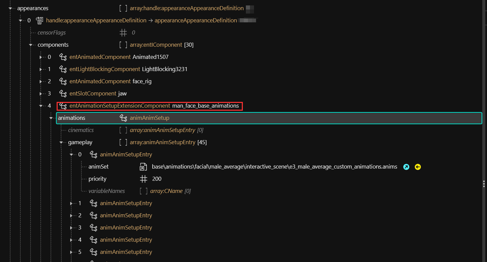

# 👤 Animations

## Summary

This page contains t**heoretical knowledge** about animations and poses (static animations) in Cyberpunk 2077. &#x20;

If you want to look up what is where, please refer to the [Cheat Sheet](../../for-mod-creators-theory/references-lists-and-overviews/cheat-sheet-rigs-and-animations.md).

## What is an animation?

An animation is a collection of **static poses** played as a sequence.&#x20;

If you want to **make** poses (replacer, [photo mode](animations/archivexl-adding-photo-mode-poses/) or [AMM](animations/amm-collab-anims-poses.md)) instead, see  the next page: Creating Animations - Poses for V & NPCs.

## What is a rig?

Also called `armature` or `skeleton`, a rig is a collection of "bones" attached to a mesh. The mesh is parented (connected) to these bones, so when the bones move, the mesh moves with them, deforming as needed. These bones are named accordingly (LeftArm, Spine3, etc.) and may be used not only for anatomical parts of a mesh, but also for parented objects such as clothes or necklaces. Rigs are also used for non-human meshes that have moving parts or can be deformed, such as cars.

Rigs can be controlled by physics, either partially (necklaces, earrings) or completely (ragdoll). In addition to being parented to meshes, bones can also be parented to invisible collision detection shapes (colliders) to prevent or minimize clipping through objects. In short, rigs are what animators actually interact with when they animate a mesh, down to the smallest details such as individual facial features.


For a list of rigs by path, see the [cheat sheet](../../for-mod-creators-theory/references-lists-and-overviews/cheat-sheet-rigs-and-animations.md#.rigs).


## Animation sets

### Body

You can find body animation sets with the following [Wolvenkit search query](https://app.gitbook.com/s/-MP_ozZVx2gRZUPXkd4r/wolvenkit-app/usage/wolvenkit-search-finding-files):

```
base\animations > locomotion > .anims
```

Reaction animations such as knockdowns, impacts, deaths, etc. can also be found with search queries containing those terms, such as simply:

### Death .anims

Which animation set a character uses, as well as associated animation graphs and rigs, are defined by `entAnimationSetupExtensionComponent`(s) and `entAnimatedComponent`(s)  in the root entity (.ent file):

<figure><figcaption></figcaption></figure>

### Face

You can find facial animation sets with the following Wolvenkit search query:&#x20;

```
base\animations\facial > .anims
```

They are referenced from an entAnimationSetupExtensionComponent inside the .app file, and also in the .ent files, which point to the associated animation graphs:



## Animation Events

Every individual animation in an .anims file has an Events subsection which often contains associated sound effects, visual effects, etc. The exact frame in which they play can be configured:

<div align="left" data-full-width="false"><figure><figcaption><p>Source file: ma_gang_unarmed_reaction_death.anims</p></figcaption></figure></div>

## Animation Graphs

Currently browsable only in collapsible list form, .animgraph files contain the logic and the parameters that govern animations for various entities in the game. For instance, all human characters have the overwhelming majority of their animation logic defined in the file **humanoid.animgraph**, containing over four thousand nodes. It basically works by detecting what state the NPC is currently in, and defining what animation should be playing, and how that animation should be modified and manipulated to suit that state or associated sub-states. For instance, any animation can be attached to a node that alters the rotation of a specific bone, or to a node that blends that animation with a different animation, or to a node that filters that animation only to a specific bone group (bone groups are defined in .rig files). That filter is called a mask, and the term "weight" does not refer to physical weight, but to how influential a node is over other nodes.

Animation graphs are also used to determine the physics behaviors of dangling objects (usually these graphs have the word "dangle" in their filename) or of moving parts that are separated from their main object, such as the parts of a car when it explodes.

<div align="left"><figure><figcaption><p>The beginning of the humanoid.animgraph file</p></figcaption></figure></div>

It is currently difficult to navigate the animation graphs. As of this writing, WolvenKit's graph editor is not yet available for this kind of file format. In the available list form, every node can be uncollapsed into more linked sub-nodes, all of which are duplicates of nodes on the main list. You can make navigation easier by numbering relevant nodes using the **debugName** field. Every duplicate of the same node will contain the text you write in that field, no matter how far down into a node tree you go:

<figure><figcaption><p>Source file: humanoid.animgraph</p></figcaption></figure>

<figure><figcaption><p>Source file: humanoid.animgraph</p></figcaption></figure>

The animation graph is extremely powerful and influential over the game, and more details regarding its functionality are being studied. It can be converted into a .json file for CTRL+F text searches, but that conversion preserves all duplicates and node trees, and is therefore over half a million lines long and 350 megabytes in size.
