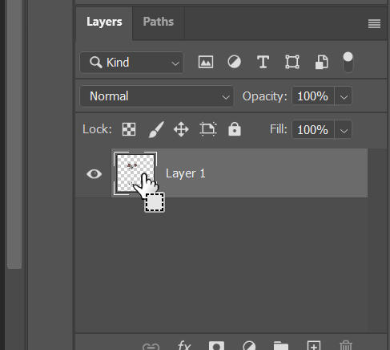

# Merging existing tattoos

## Summary

**Published**: Feb 03 2024 by [manavortex](https://app.gitbook.com/u/NfZBoxGegfUqB33J9HXuCs6PVaC3 "mention"), initial guide by Yggnire\
**Last documented edit**: 18 May 2024 by YoursTrulyBilly

This guide will teach you how to merge multiple tattoos into one.&#x20;

For this example, we'll be merging two **VTK** tattoos from [Belly Tattoos Pack](https://www.nexusmods.com/cyberpunk2077/mods/9246) and [Low Back Tattoo Pack](https://www.nexusmods.com/cyberpunk2077/mods/14557) by [Yggnire](https://www.nexusmods.com/cyberpunk2077/users/54960262)

### Wait, this is not what I want!

* If you are looking for the body layouts, check [converting-between-tattoo-frameworks](../converting-between-tattoo-frameworks/ "mention") -> [#texture-layouts](../converting-between-tattoo-frameworks/#texture-layouts "mention")
* For a more detailed guide with illustrated steps, check [how-to-create-an-overlay-tattoo.md](../how-to-create-an-overlay-tattoo.md "mention"). You can use that guide for reference.
* If you want additional information, check [converting-between-tattoo-frameworks](../converting-between-tattoo-frameworks/ "mention").

### Level of difficulty: Easy

The guide is extremely detailed and has screenshots for each step!

#### Requirements:

* **The ability to read**: mandatory, because I'm not gonna lie — this is gonna be difficult otherwise.
* **Knowing how to edit images**: recommended, because this guide will not cover it. If you don't know it, the relevant section will tell you what to Google, though
* The following two tattoo mods (kindly provided by [Yggnire](https://www.nexusmods.com/cyberpunk2077/users/54960262)):

<figure><figcaption></figcaption></figure>

### Expected time to complete:

<1h for total noobs, <15 minutes if you know what you're doing.

## Prerequisites

* [ ] You have [Wolvenkit installed](https://app.gitbook.com/s/-MP_ozZVx2gRZUPXkd4r/getting-started/download).
* [ ] You have all tattoo mods that you want to merge installed in `Cyberpunk 2077\archive\pc\mod`
* [ ] All your tattoo mods are for the same framework (if not, check the guide about [how-to-create-an-overlay-tattoo.md](../how-to-create-an-overlay-tattoo.md "mention")).


To see which files you need to edit, check this: [overlay-list.md](../converting-between-tattoo-frameworks/overlay-list.md "mention").


## Step 1: Create a Wolvenkit Project:

Depending on the supported framework, you need to name your project like this:&#x20;

| Framework | Prefix | Example name         |
| --------- | ------ | -------------------- |
| KS UV     | 004    | 004\_my\_tattoo\_mix |
| VTK       | 00     | 00\_my\_tattoo\_mix  |

If you don't know how to create a project, you can look it up on the [Wolvenkit wiki](https://app.gitbook.com/s/-MP_ozZVx2gRZUPXkd4r/wolvenkit-app/usage/wolvenkit-projects#create-a-new-wolvenkit-mod-project).

## Step 2: Add the modded files

Switch the [Asset Browser](https://app.gitbook.com/s/-MP_ozZVx2gRZUPXkd4r/wolvenkit-app/editor/asset-browser#using-the-asset-browser) tab to [Mod Browser](https://app.gitbook.com/s/-MP_ozZVx2gRZUPXkd4r/wolvenkit-app/editor/asset-browser#mod-browser) and find the two archives that you want to merge.&#x20;

You'll have to add `v_overlay.xbm` from inside these .archives [to your Wolvenkit project](https://app.gitbook.com/s/-MP_ozZVx2gRZUPXkd4r/wolvenkit-app/editor/asset-browser#adding-files-to-projects). Since they'll overwrite each other, read on to find out how to do that.


It's best to rename each tattoo after adding to make it easier for you to know which is which!


<figure><figcaption></figcaption></figure> <figure><figcaption></figcaption></figure>

1. In the asset browser, find `v_overlay.xbm` inside the first `.archive` file and add it to your project (right-click or double-click)

<figure><figcaption></figcaption></figure>

2. Re-name the file in your project to e.g. `lowbacktattoo.xbm`

<figure><figcaption></figcaption></figure>

3. Add `v_overlay.xbm` from the second `.archive` file to your project

<figure><figcaption></figcaption></figure>

4. Re-name the file in your project to e.g. `skulltattoo.xbm`
5. Add the file `v_overlay.xbm` again — this will be your final overlay.xbm


If you want to merge into a clean template, check [merging-existing-tattoos-into-a-clean-template.md](merging-existing-tattoos-into-a-clean-template.md "mention").&#x20;


## Step 3: Export for edit

1. Go to [Tools > Export Tool](https://app.gitbook.com/s/-MP_ozZVx2gRZUPXkd4r/wolvenkit-app/tools/tools-import-export#export-tool). You only need to export three of the files, but you can click `Export All`:

<figure><figcaption></figcaption></figure> <figure><figcaption></figcaption></figure>

2. You can now find the exported .png files in `source\raw\base\v_textures\body`. Time to look at them.
3. If you can't see the files in the [Project Explorer](https://app.gitbook.com/s/-MP_ozZVx2gRZUPXkd4r/wolvenkit-app/editor/project-explorer), switch it to either [source](https://app.gitbook.com/s/-MP_ozZVx2gRZUPXkd4r/wolvenkit-app/editor/project-explorer#source) or [raw](https://app.gitbook.com/s/-MP_ozZVx2gRZUPXkd4r/wolvenkit-app/editor/project-explorer#raw), or just navigate your Windows Explorer to the folder.

<figure><figcaption></figcaption></figure>

## Step 4: Photoshopping


If you don't have photoshop, you can use [photopea.com](https://www.photopea.com/) in your browser for free!


I need a reference!

You can download [Night City Tattoos](https://www.nexusmods.com/cyberpunk2077/mods/1155?tab=files), specifically the Layout Templates For Custom Tattoos:&#x20;

Once downloaded, open the file named **LayoutTemplate\_tattoo\_body\_\_customisation.psd** and drag\&drop both of your tattoo files inside.

If you need the body texture as a reference, check [merging-existing-tattoos-into-a-clean-template.md](merging-existing-tattoos-into-a-clean-template.md "mention") and export `v_body_d.png`.

1. Open `lowbacktattoo.png` in Photoshop.&#x20;
2. Drag-and-drop the second file (`skulltattoo.png`) into your open tab.
3. **Optional:** If the pictures aren't the same size, use the `W`: box at the top of the file to scale it up or down.

<figure><figcaption></figcaption></figure>

4. If your added file has been pasted as a smart object, rasterize it by right-clicking on the layer in the Layers palette
5. Merge the layer down on the base layer

<figure><figcaption></figcaption></figure>

#### Fixing the transparency

We have one last thing to do before we can import our file back, and that is **fixing the transparency**. Don't worry, we'll do it step-by-step:

1. Ctrl+click on the thumbnail in the layer palette. This will select everything, considering transparency.\
   &#x20;
2. Find the `Channels` palette. It should be right below your Layers palette, but if it's not, you might have to turn it on via **Window -> Channels**
3. At the bottom of the Channels palette, click the "Save selection as channel" icon. This will create "Alpha 1":\
   .png>)

#### Exporting

1. Select File -> Export -> export as png
2. Overwrite `v_overlay.png`

## Step 6: Importing into Wolvenkit

1. Return to WolvenKit, and open the [Import Tool](https://app.gitbook.com/s/-MP_ozZVx2gRZUPXkd4r/wolvenkit-app/tools/tools-import-export#import-tool)
2. Find  and select v\_overlay.png
3. In the sidebar, make sure that `Transparency from alpha channel` is checked
4. Import!
5. Check the files in Wolvenkit. They should have changed.
6. Delete all files that aren't `v_overlay.xbm`, since we don't need them anymore.

## Step 7: Testing the mod

1. Make sure that **no other tattoo mods** are installed — or there's a chance that you'll get to see those, rather than your new edit.
2. [Install your mod](https://app.gitbook.com/s/-MP_ozZVx2gRZUPXkd4r/wolvenkit-app/menu/toolbar#install-and-launch). Time to test!&#x20;

<figure><figcaption></figcaption></figure>

And there you have it! Go in-game and admire your new tattoos! :clap:
