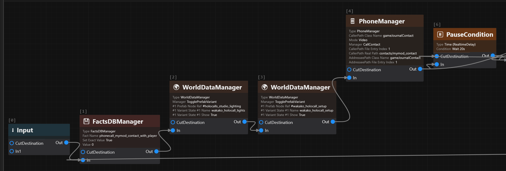
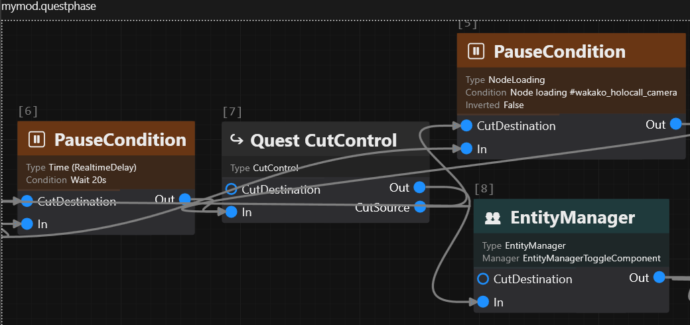
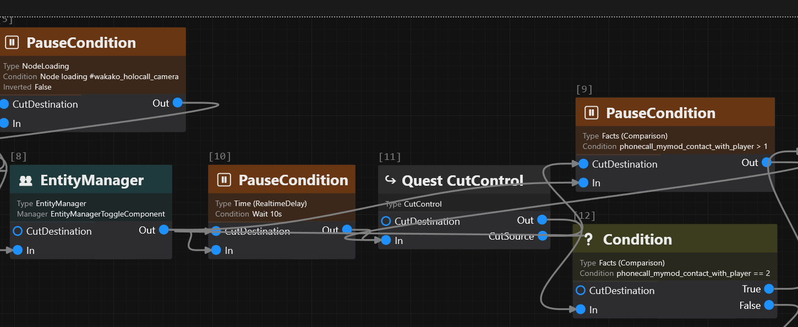
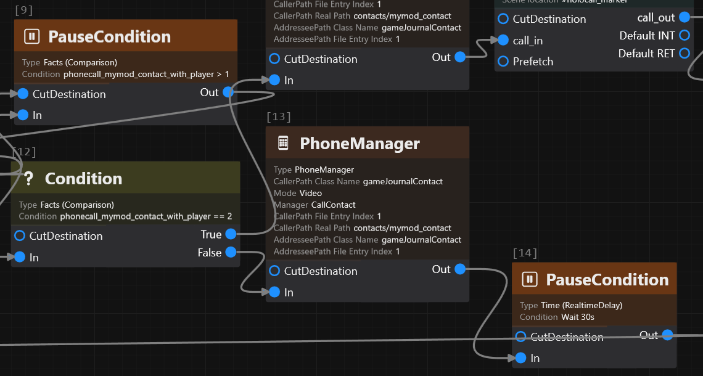
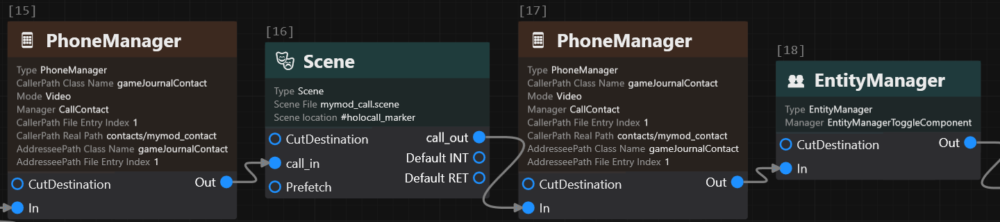
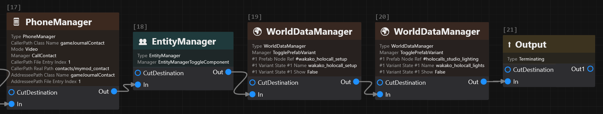
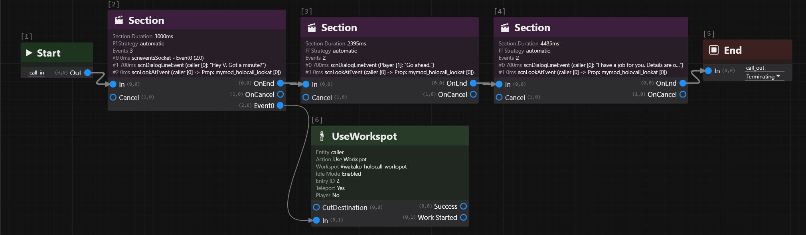

# Custom video holocalls

## Summary

A video holo call has two parts:

1. The phone runs the call itself: the ring, the name on screen, the live video and the call panel.
2. The actual words (voice, subtitles) are an ordinary scene played over it.

This guide covers:

* Creating a video holocall with a caller that you choose or create
* Starting the call from your quest phase
* Letting either the contact call V, or V call the contact

Applies to game version 2.31.

### Wait, this is not what I want!

* For a text message thread, check out [How to add new text messages thread to Cyberpunk 2077](/broken/pages/4154cb1a70bbcfce2752ae4d8fb6c991ce4e0357)
* For a conversation out in the world, check out [Creating custom scenes](/broken/pages/07668b73a01792b284e98d4e85fba9afa57d7b24)

## Requirements

### Tools

* [WolvenKit](https://github.com/WolvenKit/WolvenKit)
* [ArchiveXL](https://github.com/psiberx/cp2077-archive-xl), for your own contact and your scene's lipsync map

### Knowledge

You need to have a basic understanding of:

* Quest phases and [quest facts](/broken/pages/fc429b23906b7220bef2ca5c0e30e937f0fbaba0)
* Scenes: actors, sections and dialogue lines (check out [Quest and Scene Node Definitions](/broken/pages/b192ed5f17191537f18fe1acad954cd1a2117f60))
* Quest node sockets (check out [Name & Ordinals - Sockets 101](/broken/pages/0b2662d4f02a32bdf27bf9850e84168e0cf20346))
* [NodeRefs](/broken/pages/a75cd325791c0ea2a8ed27d35e4a1c2b31ae039c), which this page writes in the short `#name` form
* Journal contacts. The text messages guide above shows how to add one.
* TweakDB `Character` records, for a caller of your own.
* Lipsync, if you want the caller's mouth to move. Check out [Generating vanilla lipsync animation sets](/broken/pages/41e58eb79c01343f6cd0f4d3129f1755352247c5).

You also need a voice recording for every line the caller speaks. See [Adding a custom voiceline to a scene](/broken/pages/662db62ff3e3c507845f913d3edbbb33baa0b2ee). A line that already exists in the game works too.


The contact `mymod_contact` and the studio names built on `wakako` in this guide are _examples_. Use your own contact, and read the studio names from the corner you pick.


## How a call is put together

The `.scene` is no different than an in-person scene. The lines change in one way: every line the caller speaks has two settings in its `voParams`:

```
isHolocallSpeaker: 1
voExpression: Vo_Expression_Phone
```

They basically control where the audio comes from: the phone instead of out of a body.

The call node has a `phase` field with three values, used in this order: `IncomingCall` rings the phone, `StartCall` opens the call panel and the live picture, and `EndCall` hangs up.

While a call is live, the game reports its state in a fact. The fact is named `phonecall_<caller>_with_<receiver>`. Both names are contact ids in lowercase.

The id is the last part of the journal path, so a call from `contacts/mymod_contact` to `contacts/player` becomes `phonecall_mymod_contact_with_player`.

`phonecall_<caller>_with_<receiver>` can have the following values:

| Value | Meaning                          |
| ----- | -------------------------------- |
| 0     | ended                            |
| 1     | ringing, or the panel is opening |
| 2     | talking                          |
| 3     | declined                         |

## Use a contact that you create

Always create a new contact for the call. Don't use the contact the game already has, even when your caller is a game character like Wakako. Give your contact the same name and the same picture. The player's contact list then shows two entries that look the same.

The reason: every game contact has its own phone conversation built in (the small talk you get when you call them). If V calls the game's original contact, that conversation opens on top of yours, including the dialogue choices. This was seen when V calls. For the other direction it was not tested, so use your own contact both ways. The clone contact you make has no conversation of its own, so none of that happens.

To make one: add a contact to your mod's journal file with 3 properties:

1. An id, for example `mymod_contact` which is used by the quest to make the call
2. A name, for example "Wakako Okada", which is shown to the player
3. A picture. If the character already exists, use the existing picture named `PhoneAvatars.Avatar_<name>`. For example Wakako's is `PhoneAvatars.Avatar_Wakako`.



## Create the journal file

In WolvenKit, select **File, New File**. Create a journal file and save it as `mod\mymod\journal\mymod.journal`.

Add a folder entry (`gameJournalPrimaryFolderEntry`) with the id `contacts`. Add a contact inside it.

<details>

<summary>Show the JSON</summary>

```json
{
  "$type": "gameJournalContact",
  "id": "mymod_contact",
  "avatarID": {
    "$type": "TweakDBID",
    "$storage": "string",
    "$value": "PhoneAvatars.Avatar_Wakako"
  },
  "name": {
    "unk1": "0",
    "value": "mymod-contact-name"
  },
  "type": "Texter",
  "isCallableDefault": 0,
  "useFlatMessageLayout": 1,
  "journalEntryOverrideDataList": [],
  "entries": []
}
```

</details>



## Create the onscreens file

Select **File, New File**. Create an onscreens file and save it as `mod\mymod\localization\en-us.json`.

Add one entry for the contact's name.

<details>

<summary>Show the JSON</summary>

```json
{
  "$type": "localizationPersistenceOnScreenEntry",
  "femaleVariant": "Wakako Okada",
  "maleVariant": "",
  "primaryKey": "0",
  "secondaryKey": "mymod-contact-name"
}
```

</details>



## Add the files to ArchiveXL

Open your `.archive.xl` in a text editor. Add these lines.

<details>

<summary>Show the lines</summary>

```yaml
journal:
  - mod\mymod\journal\mymod.journal
localization:
  onscreens:
    en-us:
      - mod\mymod\localization\en-us.json
```

</details>



## The studio

The live video on the phone comes from a camera in a hidden room, far outside the map. It films a character standing there. The game calls this room the holocall studio. Your caller has to be in that room, in front of a camera. Otherwise the player sees nobody.

The room has one corner per game character. Each corner has four things: its own lights, its own camera, a spot where the character sits or stands, and a small marker the character looks at.

For Wakako the pieces are:

| Piece                       | NodeRef                      | Variant name             |
| --------------------------- | ---------------------------- | ------------------------ |
| the room itself             | `#holocalls_studio`          |                          |
| the spawn point in the room | `#holocall_marker`           |                          |
| the lights                  | `#holocalls_studio_lighting` | `wakako_holocall_lights` |
| Wakako's corner             | `#wakako_holocall_setup`     | `wakako_holocall_setup`  |
| her camera                  | `#wakako_holocall_camera`    |                          |
| the spot she sits in        | `#wakako_holocall_workspot`  |                          |
| the marker she looks at     | `#wakako_holocall_lookat`    |                          |

The NodeRef is the address of a thing in the room. The variant name is a switch inside that thing. Later, in the quest phase section, you switch two of them on: the lights and the corner.

Your caller can use the corner of a game character. Use Wakako's, and your caller gets her lights, her camera, her chair and her marker.

Pick the corner by pose:

* Your caller sits: use a corner where the character sits. Wakako sits at a desk.
* Your caller stands: use a corner where the character stands. Mama Welles stands at a bar.
* Your caller is a game character: use their own corner. Their files are in their own folder under `base\quest\holocalls\`.

Where the names are:



## Find the variant names

Open `base\quest\holocalls\wakako\wakako_holocall.scene` in WolvenKit.

Its two `questTogglePrefabVariant_NodeType` nodes give the "Variant name" column.



## Find the studio pieces

Open `quest_ec82d0423d8f1435.streamingsector`. Search for it in the asset browser.

This is the room. It has every character's camera, chair and marker.



## Find the workspot file

Click the chair. Its `spot.resource` names the `.workspot` file with the pose.

The scene section below needs that file.



## Check the camera height

Click the camera. Its position's Z value is its height.

About 0.93 means the character sits. About 1.52 means they stand. Use this to pick a corner for a character of your own.



## The quest phase

Build the call as a chain of quest nodes, in the order below. The base game `base\quest\holocalls\wakako\wakako_holocall.scene` has a similar chain, so you can compare yours to it. Step 6 is the one place yours must differ.

Most steps have a JSON block with the node's settings. Add the node in WolvenKit's graph view. Then copy the values from the block into its fields. The field names are the same. Don't copy `id` fields; WolvenKit assigns them. Every block shows the case where your contact calls V.



## Reset the phone

Add a `questFactsDBManagerNodeDefinition` with a `questSetVar_NodeType`. Set the fact `phonecall_mymod_contact_with_player` to 0.

When V is the caller, the fact is `phonecall_player_with_mymod_contact`.

This is needed because the fact keeps its last value. If it is still 2, the new call connects before the phone even rings.

<details>

<summary>Show the JSON</summary>

**questSetVar\_NodeType**

```json
{
  "$type": "questSetVar_NodeType",
  "factName": "phonecall_mymod_contact_with_player",
  "setExactValue": 1,
  "value": 0
}
```

</details>



## Switch the room on

Add two `questWorldDataManagerNodeDefinition` nodes: one for the lights, one for the corner. Give each a `questTogglePrefabVariant_NodeType` with one entry in `params`:

| Field           | Value                                                                                  |
| --------------- | -------------------------------------------------------------------------------------- |
| `prefabNodeRef` | `#holocalls_studio_lighting` on the first node. `#wakako_holocall_setup` on the second |
| `variantStates` | one `questVariantState`. Its name is the variant name from the table. Its `show` is 1  |

<details>

<summary>Show the JSON</summary>

**questTogglePrefabVariant\_NodeType, the lights. The corner is the same with the other two names**

```json
{
  "$type": "questTogglePrefabVariant_NodeType",
  "params": [
    {
      "$type": "questTogglePrefabVariant_NodeTypeParams",
      "prefabNodeRef": {
        "$type": "NodeRef",
        "$storage": "string",
        "$value": "#holocalls_studio_lighting"
      },
      "variantStates": [
        {
          "$type": "questVariantState",
          "name": {
            "$type": "CName",
            "$storage": "string",
            "$value": "wakako_holocall_lights"
          },
          "show": 1
        }
      ]
    }
  ]
}
```

</details>



## Place the call

Add a `questPhoneManagerNodeDefinition` with a `questCallContact_NodeType`:

| Field                   | Value                                                                                 |
| ----------------------- | ------------------------------------------------------------------------------------- |
| `caller`                | `contacts/mymod_contact` when your contact calls V. `contacts/player` when V calls    |
| `addressee`             | the receiver. The other one of the two                                                |
| `phase`                 | `IncomingCall`, in all cases                                                          |
| `mode`                  | `Video`                                                                               |
| `prefabNodeRef`         | `#holocalls_studio`                                                                   |
| `isRejectable`          | 1 when your contact calls V. The phone then offers answer and decline. 0 when V calls |
| `showAvatar`            | 0                                                                                     |
| `visuals`               | `Default`                                                                             |
| `applyPhoneRestriction` | 0 (see Tips)                                                                          |

Placing the call is what loads the room. So this node comes before the camera wait.

<details>

<summary>Show the JSON</summary>

**questCallContact\_NodeType, your contact calling V**

```json
{
  "$type": "questCallContact_NodeType",
  "addressee": {
    "Data": {
      "$type": "gameJournalPath",
      "className": {
        "$type": "CName",
        "$storage": "string",
        "$value": "gameJournalContact"
      },
      "editorPath": "",
      "fileEntryIndex": 1,
      "realPath": "contacts/player"
    }
  },
  "applyPhoneRestriction": 0,
  "caller": {
    "Data": {
      "$type": "gameJournalPath",
      "className": {
        "$type": "CName",
        "$storage": "string",
        "$value": "gameJournalContact"
      },
      "editorPath": "",
      "fileEntryIndex": 1,
      "realPath": "contacts/mymod_contact"
    }
  },
  "isRejectable": 1,
  "mode": "Video",
  "phase": "IncomingCall",
  "prefabNodeRef": {
    "$type": "NodeRef",
    "$storage": "string",
    "$value": "#holocalls_studio"
  },
  "showAvatar": 0,
  "visuals": "Default"
}
```

</details>



<figure><figcaption><p>Steps 1 to 3 in WolvenKit: reset the phone, switch the room on, place the call</p></figcaption></figure>

## Wait for the camera to load

Add a `questPauseConditionNodeDefinition` with a `questNodeLoadingCondition`. Set `objectRef` to `#wakako_holocall_camera`.

Give it a time limit. Without one, the quest stops here forever if the room never loads. Wire it like this:

```
                 +-- wait: camera loaded --+
place the call -+                         +-- cut control -- camera on
                 +-- wait: 20 seconds -----+
```

| Box                 | Node                                                                                                                                                                        |
| ------------------- | --------------------------------------------------------------------------------------------------------------------------------------------------------------------------- |
| wait: camera loaded | `questPauseConditionNodeDefinition` with a `questNodeLoadingCondition` on the camera                                                                                        |
| wait: 20 seconds    | `questPauseConditionNodeDefinition` with a `questTimeCondition` and a `questRealtimeDelay_ConditionType`                                                                    |
| cut control         | `questCutControlNodeDefinition`. It has an output socket named `CutSource`. Connect it to the `CutDestination` socket of each wait. The picture below shows these two wires |

The wait that finishes first continues and cancels the other.

<details>

<summary>Show the JSON</summary>

**questNodeLoadingCondition, on the camera wait**

```json
{
  "$type": "questNodeLoadingCondition",
  "inverted": 0,
  "objectRef": {
    "$type": "NodeRef",
    "$storage": "string",
    "$value": "#wakako_holocall_camera"
  }
}
```

**questTimeCondition, on the 20 second wait. The game spells the field `miliseconds`**

```json
{
  "$type": "questTimeCondition",
  "type": {
    "Data": {
      "$type": "questRealtimeDelay_ConditionType",
      "hours": 0,
      "miliseconds": 0,
      "minutes": 0,
      "seconds": 20
    }
  }
}
```

</details>

<figure><figcaption><p>Step 4 in WolvenKit: wait for the camera, with a time limit</p></figcaption></figure>



## Switch the camera on

Add a `questEntityManagerNodeDefinition` with a `questEntityManagerToggleComponent_NodeType`. The camera is off by default. This node puts the picture on the phone.

| Field           | Value                                                                                         |
| --------------- | --------------------------------------------------------------------------------------------- |
| `componentName` | `RenderToTextureCamera`                                                                       |
| `enable`        | 1                                                                                             |
| `objectRef`     | a `gameEntityReference` of type `EntityRef`. Set its `reference` to `#wakako_holocall_camera` |

<details>

<summary>Show the JSON</summary>

**questEntityManagerToggleComponent\_NodeType**

```json
{
  "$type": "questEntityManagerToggleComponent_NodeType",
  "params": [
    {
      "$type": "questEntityManagerToggleComponent_NodeTypeParams",
      "componentName": {
        "$type": "CName",
        "$storage": "string",
        "$value": "RenderToTextureCamera"
      },
      "enable": 1,
      "isPlayer": 0,
      "objectRef": {
        "$type": "gameEntityReference",
        "dynamicEntityUniqueName": {
          "$type": "CName",
          "$storage": "string",
          "$value": "None"
        },
        "names": [],
        "reference": {
          "$type": "NodeRef",
          "$storage": "string",
          "$value": "#wakako_holocall_camera"
        },
        "sceneActorContextName": {
          "$type": "CName",
          "$storage": "string",
          "$value": "None"
        },
        "slotName": {
          "$type": "CName",
          "$storage": "string",
          "$value": "None"
        },
        "type": "EntityRef"
      }
    }
  ]
}
```

</details>



## Wait for the player to answer

If V is the caller, skip the wait. Add a `questPauseConditionNodeDefinition` with a `questTimeCondition` of 2 to 4 seconds, for the dial tone. Then go to step 7.

If your contact is the caller, wait for the player to pick up. Wire it like step 4:

```
camera on
  |-- wait: fact above 1 --+
  +-- wait: 10 seconds ----+-- cut control -- is the fact 2?
                                                |-- yes: step 7
                                                +-- no:  hang up, retry
```

| Box                | Node                                                                                                                                                                 |
| ------------------ | -------------------------------------------------------------------------------------------------------------------------------------------------------------------- |
| wait: fact above 1 | `questPauseConditionNodeDefinition` with a `questFactsDBCondition` and a `questVarComparison_ConditionType`. Fact: the one from step 1. Comparison: `Greater` than 1 |
| wait: 10 seconds   | `questPauseConditionNodeDefinition` with a `questTimeCondition` and a `questRealtimeDelay_ConditionType`. The phone stops ringing after 8 seconds                    |
| cut control        | `questCutControlNodeDefinition`, wired as in step 4                                                                                                                  |
| is the fact 2?     | `questConditionNodeDefinition` with the same comparison, `Equal` to 2. It has a `True` and a `False` socket                                                          |
| hang up, retry     | the call node from step 3 with `phase` set to `EndCall`. Then a 30 second wait. Then back to step 1                                                                  |

Without a limit on the retries, a player who never answers has a quest that never finishes. To add one, count the tries in a fact of your own: a `questSetVar_NodeType` before the 30 second wait, and a `questConditionNodeDefinition` on that fact before the jump back to step 1.

<details>

<summary>Show the JSON</summary>

**questFactsDBCondition, on the fact wait**

```json
{
  "$type": "questFactsDBCondition",
  "type": {
    "Data": {
      "$type": "questVarComparison_ConditionType",
      "comparisonType": "Greater",
      "factName": "phonecall_mymod_contact_with_player",
      "value": 1
    }
  }
}
```

**questFactsDBCondition, on the check**

```json
{
  "$type": "questFactsDBCondition",
  "type": {
    "Data": {
      "$type": "questVarComparison_ConditionType",
      "comparisonType": "Equal",
      "factName": "phonecall_mymod_contact_with_player",
      "value": 2
    }
  }
}
```

</details>

<figure><figcaption><p>Step 6 in WolvenKit: wait for the player to answer, with a time limit, then check the answer</p></figcaption></figure>

<figure><figcaption><p>Step 6, when the player declines: hang up, wait 30 seconds, go back to step 1</p></figcaption></figure>


Don't use `questPhonePickUp_ConditionType` here. The game's own scenes use it. For a call placed from your own quest phase it never finishes.




## Open the call

Add the call node from step 3 again, with `phase` set to `StartCall`.

This opens the call panel and the video. Answering the phone alone doesn't open them.



## Play your scene

Add a `questSceneNodeDefinition`. Set `sceneLocation` to `#holocall_marker`. That is where your caller spawns.

The next section says what goes in the scene.

<details>

<summary>Show the JSON</summary>

**questSceneNodeDefinition**

```json
{
  "$type": "questSceneNodeDefinition",
  "id": 98,
  "interruptionOperations": [],
  "notAllowedToBeFrozen": 0,
  "reapplyInterruptionOperationsAfterGameLoad": 0,
  "sceneFile": {
    "DepotPath": {
      "$type": "ResourcePath",
      "$storage": "string",
      "$value": "mod\\mymod\\scenes\\mymod_call.scene"
    },
    "Flags": "Soft"
  },
  "sceneLocation": {
    "$type": "scnWorldMarker",
    "nodeRef": {
      "$type": "NodeRef",
      "$storage": "string",
      "$value": "#holocall_marker"
    },
    "tag": {
      "$type": "CName",
      "$storage": "string",
      "$value": "None"
    },
    "type": "NodeRef"
  },
  "syncToMusic": 0
}
```

</details>

<figure><figcaption><p>Steps 7 and 8 in WolvenKit: open the call, play the scene</p></figcaption></figure>



## Hang up and switch the room off

Add these in a row:

1. The call node, with `phase` set to `EndCall`.
2. The camera node from step 5, with `enable` set to 0.
3. The two nodes from step 2, with `show` set to 0.

<figure><figcaption><p>Step 9 in WolvenKit: hang up, switch the camera off, switch the room off</p></figcaption></figure>



## The scene

<figure><figcaption><p>The scene in WolvenKit: the three lines of the call, and the box that seats the caller in the chair</p></figcaption></figure>



## Create the scene file

Select **File, New File**. Create a scene file and save it as `mod\mymod\scenes\mymod_call.scene`, the path from step 8 of the quest phase.



## Add your caller to the scene

A scene lists every character in it as an actor. Add one actor for your caller, with these fields:

| Field                                   | Value                                                                                                     |
| --------------------------------------- | --------------------------------------------------------------------------------------------------------- |
| `acquisitionPlan`                       | `spawnDespawn`                                                                                            |
| `spawnDespawnParams.specRecordId`       | your caller's `Character` record. A game character has one already. For a character of your own, make one |
| `spawnDespawnParams.spawnOffset`        | 0, 0, 0. The caller spawns at the scene's marker from step 8 of the quest phase                           |
| `spawnDespawnParams.forceMaxVisibility` | 1                                                                                                         |

The reason for the last one: the room is kilometres away. The game stops drawing characters that far off. This setting keeps your caller drawn.

<details>

<summary>Show the JSON</summary>

**scnActorDef, the fields that matter. Leave the rest at their defaults**

```json
{
  "$type": "scnActorDef",
  "acquisitionPlan": "spawnDespawn",
  "actorName": "wakako",
  "spawnDespawnParams": {
    "$type": "scnSpawnDespawnEntityParams",
    "alwaysSpawned": 1,
    "appearance": {
      "$type": "CName",
      "$storage": "string",
      "$value": "default"
    },
    "dynamicEntityUniqueName": {
      "$type": "CName",
      "$storage": "string",
      "$value": "wakako"
    },
    "findInWorld": 0,
    "forceMaxVisibility": 1,
    "isEnabled": 1,
    "itemOwnerId": {
      "$type": "scnPerformerId",
      "id": 4294967040
    },
    "keepAlive": 0,
    "prefetchAppearance": 0,
    "spawnMarker": {
      "$type": "CName",
      "$storage": "string",
      "$value": "None"
    },
    "spawnMarkerNodeRef": {
      "$type": "NodeRef",
      "$storage": "uint64",
      "$value": "0"
    },
    "spawnMarkerType": "Local",
    "spawnOffset": {
      "$type": "Transform",
      "orientation": {
        "$type": "Quaternion",
        "i": 0,
        "j": 0,
        "k": 0,
        "r": 1
      },
      "position": {
        "$type": "Vector4",
        "W": 0,
        "X": 0.0,
        "Y": 0.0,
        "Z": 0.0
      }
    },
    "spawnOnStart": 1,
    "specRecordId": {
      "$type": "TweakDBID",
      "$storage": "string",
      "$value": "Character.mymod_contact"
    },
    "validateSpawnPostion": 0
  }
}
```

</details>



## Put the caller on the spot of the corner you chose

This is the spot from the studio table, `#wakako_holocall_workspot` for Wakako's corner.

Add a `questUseWorkspotNodeDefinition` inside a `scnQuestNode`. Set `entityReference` to your actor's `dynamicEntityUniqueName`. Set these in `paramsV1`:

| Field                                                                                          | Value                                                                                                                                                                                    |
| ---------------------------------------------------------------------------------------------- | ---------------------------------------------------------------------------------------------------------------------------------------------------------------------------------------- |
| `workspotNode`                                                                                 | `#wakako_holocall_workspot`                                                                                                                                                              |
| `teleport`, `instant`, `jumpToEntry`, `enableIdleMode`, `changeWorkspot`, `isWorkspotInfinite` | all 1                                                                                                                                                                                    |
| `entryId`                                                                                      | the idle in the spot's `.workspot` file. Open that file and find `workspotTree`. The root is `workSequence` 1. The idle is the sequence with the loop of clips. In Wakako's file it is 2 |

The spot gives your caller three things: where to stand, which way to face, and the pose.

Wire the `UseWorkspot` box off the side of the first section. The scene picture at the top of this section shows it: the `UseWorkspot` box hangs off the first section's extra socket, which WolvenKit labels `Event0`.

1. Select the first section box. Add a `scneventsSocket` event to it, at time 0.
2. Give the event socket name 2. Names 0 and 1 are the section's own exits.
3. Connect the new socket to the `UseWorkspot` box. Connect nothing after the box.

The reason: on the main flow, a node that fails to start stops the scene forever. Off the side, the worst case is a caller in the wrong pose.

<details>

<summary>Show the JSON</summary>

**questUseWorkspotNodeDefinition**

```json
{
  "$type": "questUseWorkspotNodeDefinition",
  "entityReference": {
    "$type": "gameEntityReference",
    "dynamicEntityUniqueName": {
      "$type": "CName",
      "$storage": "string",
      "$value": "wakako"
    },
    "names": [],
    "reference": {
      "$type": "NodeRef",
      "$storage": "uint64",
      "$value": "0"
    },
    "sceneActorContextName": {
      "$type": "CName",
      "$storage": "string",
      "$value": "None"
    },
    "slotName": {
      "$type": "CName",
      "$storage": "string",
      "$value": "None"
    },
    "type": "EntityRef"
  },
  "id": 9,
  "paramsV1": {
    "Data": {
      "$type": "questUseWorkspotParamsV1",
      "changeWorkspot": 1,
      "enableIdleMode": 1,
      "instant": 1,
      "isWorkspotInfinite": 1,
      "jumpToEntry": 1,
      "teleport": 1,
      "continueInCombat": 0,
      "dangleResetSimulation": 0,
      "entryId": {
        "$type": "workWorkEntryId",
        "id": 2
      },
      "entryTag": {
        "$type": "CName",
        "$storage": "string",
        "$value": "None"
      },
      "exitAnimName": {
        "$type": "CName",
        "$storage": "string",
        "$value": "None"
      },
      "exitEntryId": {
        "$type": "workWorkEntryId",
        "id": 4294967295
      },
      "finishAnimation": 0,
      "forceEntryAnimName": {
        "$type": "CName",
        "$storage": "string",
        "$value": "None"
      },
      "function": "UseWorkspot",
      "isPlayer": 0,
      "maxAnimTimeLimit": 0,
      "meshDissolvingEnabled": 1,
      "movementType": "Walk",
      "playerParams": {
        "$type": "questUseWorkspotPlayerParams",
        "applyCameraParams": 0,
        "cameraSettings": {
          "$type": "gameTier3CameraSettings",
          "pitchBottomLimit": 45,
          "pitchSpeedMultiplier": 1,
          "pitchTopLimit": 60,
          "yawLeftLimit": 60,
          "yawRightLimit": 60,
          "yawSpeedMultiplier": 1
        },
        "cameraUseTrajectorySpace": 1,
        "emptyHands": 0,
        "parallaxSpace": "Trajectory",
        "parallaxWeight": 1,
        "tier": "Tier3",
        "vehicleProceduralCameraWeight": 1
      },
      "repeatCommandOnInterrupt": 0,
      "workExcludedGestures": [],
      "workspotNode": {
        "$type": "NodeRef",
        "$storage": "string",
        "$value": "#wakako_holocall_workspot"
      }
    }
  }
}
```

**scneventsSocket, the extra socket on the first section**

```json
{
  "$type": "scneventsSocket",
  "duration": 0,
  "executionTagFlags": 0,
  "id": {
    "$type": "scnSceneEventId",
    "id": "2486148153096389181"
  },
  "osockStamp": {
    "$type": "scnOutputSocketStamp",
    "name": 2,
    "ordinal": 0
  },
  "scalingData": null,
  "startTime": 0,
  "type": "0"
}
```

</details>



## Make the caller look into the camera

First add the marker as a prop of the scene. It is a `scnPropDef` with two settings:

| Field                            | Value                     |
| -------------------------------- | ------------------------- |
| `entityAcquisitionPlan`          | `findInNode`              |
| `findEntityInNodeParams.nodeRef` | `#wakako_holocall_lookat` |

Then add a `scnLookAtEvent` to **every** section of the scene, at time 0:

| Field                           | Value                                     |
| ------------------------------- | ----------------------------------------- |
| `performerId`                   | your actor                                |
| `targetPerformerId`             | the prop                                  |
| `targetSlot`                    | `(Root)`                                  |
| `removePreviousAdvancedLookAts` | 1                                         |
| `bodyPart`                      | `Eyes`                                    |
| `additionalParts`               | `Head` at weight 0.1, `Chest` at weight 2 |

Copy the two weights as they are. They are the game's own preset. Leave `targetType` at `Actor`: the game's own event that aims at this marker uses that value.

Your actor's id is 1 and the prop's id is 2. The rule behind it: `index * 256 + kind`, with kind 1 for an actor and 2 for a prop.

<details>

<summary>Show the JSON</summary>

**scnPropDef, the fields that matter. Leave the rest at their defaults**

```json
{
  "$type": "scnPropDef",
  "propName": "mymod_holocall_lookat",
  "propId": {
    "$type": "scnPropId",
    "id": 0
  },
  "entityAcquisitionPlan": "findInNode",
  "findEntityInNodeParams": {
    "$type": "scnFindEntityInNodeParams",
    "forceMaxVisibility": 0,
    "nodeRef": {
      "$type": "NodeRef",
      "$storage": "string",
      "$value": "#wakako_holocall_lookat"
    }
  }
}
```

**scnLookAtEvent**

```json
{
  "$type": "scnLookAtEvent",
  "basicData": {
    "$type": "scnLookAtBasicEventData",
    "basic": {
      "$type": "scnAnimTargetBasicData",
      "isStart": 1,
      "performerId": {
        "$type": "scnPerformerId",
        "id": 1
      },
      "staticTarget": {
        "$type": "Vector4",
        "W": 1,
        "X": 0,
        "Y": 0,
        "Z": 0
      },
      "targetActorId": {
        "$type": "scnActorId",
        "id": 4294967295
      },
      "targetOffsetEntitySpace": {
        "$type": "Vector4",
        "W": 0,
        "X": 0,
        "Y": 0,
        "Z": 0
      },
      "targetPerformerId": {
        "$type": "scnPerformerId",
        "id": 2
      },
      "targetPropId": {
        "$type": "scnPropId",
        "id": 4294967295
      },
      "targetSlot": {
        "$type": "CName",
        "$storage": "string",
        "$value": "(Root)"
      },
      "targetType": "Actor"
    },
    "removePreviousAdvancedLookAts": 1,
    "requests": [
      {
        "$type": "animLookAtRequestForPart",
        "attachLeftHandToRightHand": -1,
        "attachRightHandToLeftHand": -1,
        "bodyPart": {
          "$type": "CName",
          "$storage": "string",
          "$value": "Eyes"
        },
        "request": {
          "$type": "animLookAtRequest",
          "additionalParts": {
            "Elements": [
              {
                "$type": "animLookAtPartRequest",
                "mode": 0,
                "partName": {
                  "$type": "CName",
                  "$storage": "string",
                  "$value": "Head"
                },
                "suppress": 0,
                "weight": 0.100000024
              },
              {
                "$type": "animLookAtPartRequest",
                "mode": 0,
                "partName": {
                  "$type": "CName",
                  "$storage": "string",
                  "$value": "Chest"
                },
                "suppress": 0,
                "weight": 2
              }
            ]
          },
          "calculatePositionInParentSpace": 0,
          "debugInfo": "Scene preset: \"Eyes & Head\"",
          "followingSpeedFactorOverride": -1,
          "hasOutTransition": 0,
          "invalid": 0,
          "limits": {
            "$type": "animLookAtLimits",
            "backLimitDegrees": 210,
            "hardLimitDegrees": 270,
            "hardLimitDistance": 1000000,
            "softLimitDegrees": 360
          },
          "mode": 0,
          "outTransitionSpeed": 60,
          "priority": -1,
          "suppress": 0,
          "transitionSpeed": 80
        }
      }
    ]
  },
  "duration": 1000,
  "executionTagFlags": 0,
  "id": {
    "$type": "scnSceneEventId",
    "id": "3428037399447279130"
  },
  "scalingData": null,
  "startTime": 0,
  "type": "0"
}
```

</details>



## Add the required flags to the lines

Give every line the caller speaks the two settings from the top of the page.

<details>

<summary>Show the JSON</summary>

**scnDialogLineVoParams, on every line the caller speaks**

```json
{
  "$type": "scnDialogLineVoParams",
  "alwaysUseBrainGender": 0,
  "customVoEvent": {
    "$type": "CName",
    "$storage": "string",
    "$value": "None"
  },
  "disableHeadMovement": 0,
  "ignoreSpeakerIncapacitation": 1,
  "isHolocallSpeaker": 1,
  "voContext": "Vo_Context_Quest",
  "voExpression": "Vo_Expression_Phone"
}
```

</details>



## Add lipsync

If you want the mouth to move, follow [Generating vanilla lipsync animation sets](/broken/pages/41e58eb79c01343f6cd0f4d3129f1755352247c5) for your caller's lines.

Without it the call works and the mouth stays shut.



## Checklist

A mistake in any of the steps above gives no error message. If the call looks wrong, find what you see in the right column. Fix the thing on the left.

| Thing                                                    | What you see without it                           |
| -------------------------------------------------------- | ------------------------------------------------- |
| the lights of the corner you chose, switched on          | the caller is barely lit                          |
| the corner you chose, switched on                        | no camera, no chair, no marker                    |
| the call (step 3) placed before the camera wait (step 4) | an empty frame, only on a fresh start of the game |
| `RenderToTextureCamera` switched on                      | an empty frame                                    |
| `forceMaxVisibility` on the actor                        | the room, with nobody in it                       |
| the caller put on the spot                               | standing at the spawn point, half out of frame    |
| the look-at event on every section                       | eyes wandering past the camera                    |
| a lipsync animation set on the actor                     | the mouth doesn't move                            |

## Testing



## Test on a fresh start

Test on a fresh start of the game. If a holocall has played since the game started, the room is still loaded. A mistake in steps 3 to 5 might not show.



## Start the call

The phone rings, or V dials.



## Answer

Check that your caller is on the screen, in the correct pose, well lit, looking into the camera, mouth moving.



## Check the checklist

If something is wrong, use the checklist above.



## Test declining and ringing out

Only when your contact is the caller: reload the save and start the quest again. Decline this time. Reload once more and let it ring out.

Both times the call should come back after the wait you set.



## Tips

**The phone won't ring during combat, in a menu or on a loading screen.** A call placed then is lost. The retry in step 6 covers it.

**Leave `applyPhoneRestriction` at 0.** If you set it to 1, it locks the phone during the call. If your call is abandoned halfway for any reason, the lock is never removed. The phone then stays locked for the rest of the save.

**Reusing a line the game already voiced.** The game has phone versions of some of its recordings. They are in `base\localization\<language>\vo_holocall\`, under the same file name as the normal version. Your holocall line plays the phone version when there is one. When there is none, that line sounds clean while the rest of the call sounds like a phone. Check that folder for the file name before you pick the line.
