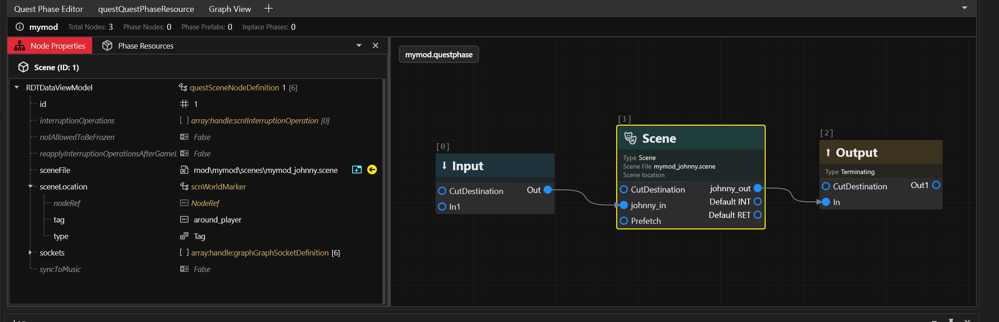
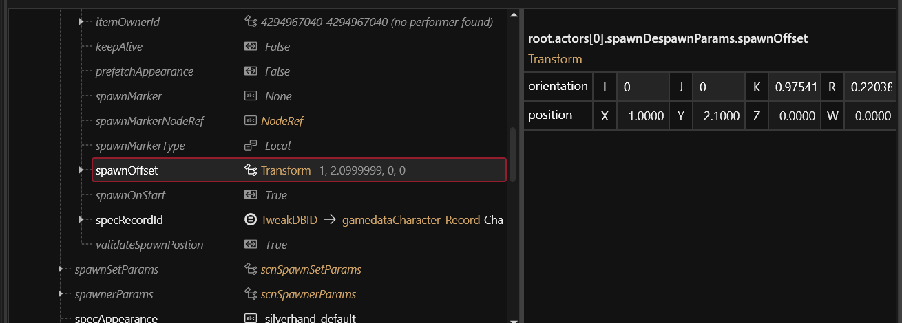
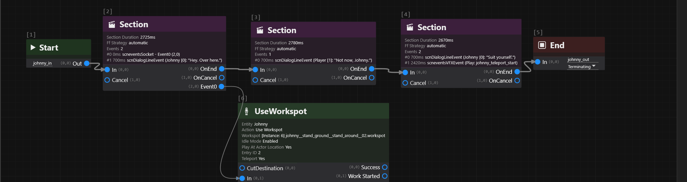
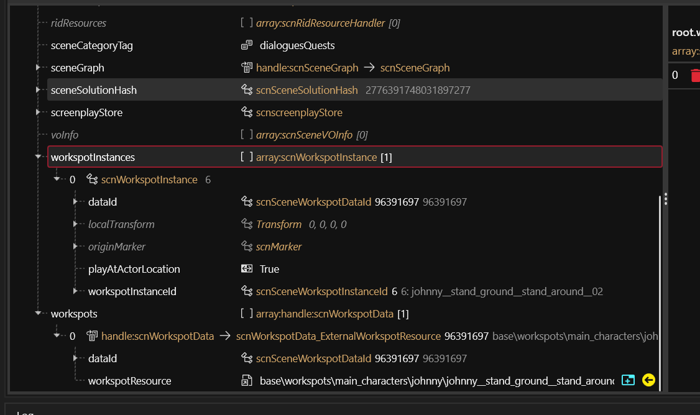
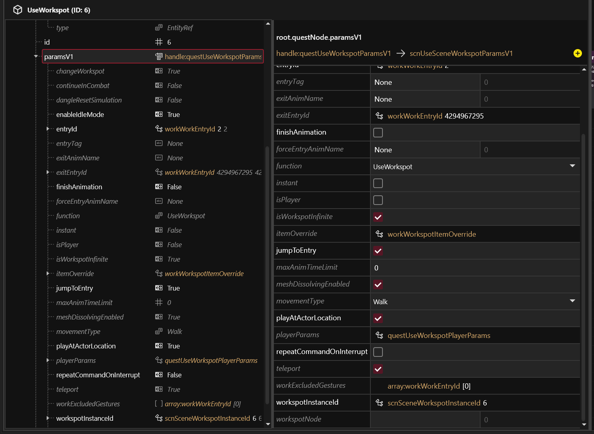
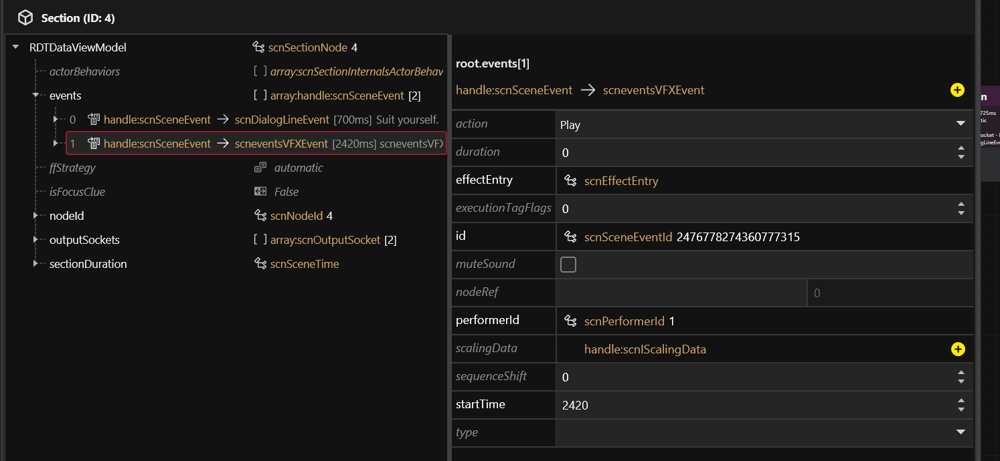

# Johnny glitching and talking with V

## Summary

This guide builds a short scene with Johnny near V. It works anywhere in the world.

It covers:

* Starting a scene where V is standing
* Putting Johnny a set distance in front of V, turned to face V
* Glitching him out when the scene ends

Applies to game version 2.31.

### Wait, this is not what I want!

* For a conversation at a fixed place in the world, check out [Creating custom scenes](/broken/pages/38d434442345df146fa4747eb60378a8b33c8457)
* For a caller on the phone, check out [Custom video holocalls](/broken/pages/384e5c0d0631e85f099aa2f713a6cbbf5ba1af69)
* To pose Johnny for screenshots, check out [AMM](/broken/pages/ff34abc98f817737bc77d0ba5fabb75366ba97d8)

## Requirements

### Tools

* [WolvenKit](https://github.com/WolvenKit/WolvenKit)
* (optional) Python, to work out Johnny's facing for a spot that isn't in the table below

### Knowledge

* You need to have a basic understanding of:
  * Quest phases: how your phase is loaded, and how it reaches a scene. Also [quest facts](/broken/pages/80b4776dd3c8e50d85b961c3927a14fbcc424899)
  * Scenes: actors, sections and dialogue lines (check out [Quest and Scene Node Definitions](/broken/pages/60913b7446d40d31735b521a250d40cadf38ac7b))
  * Scene sockets (check out [Name & Ordinals - Sockets 101](/broken/pages/f5c942b2cf0f70432190aa454802dc8785f364c1))
* Johnny's lines need audio. A line the game already recorded works. Check out [Adding a custom voiceline to a scene](/broken/pages/05c1b6bcf767b3b251a72e7328de5620c26b8b0e).
* (optional) Lipsync, if you want his mouth to move. Check out [Generating vanilla lipsync animation sets](/broken/pages/e97d805e214957f2e5507a1acac3839b6dd7ab21).


The scene path `mod\mymod\scenes\mymod_johnny.scene` in this guide is an _example_. Use your own.


## Working in WolvenKit

Do every step in WolvenKit:

1. Open your quest phase or your scene.
2. Add nodes in the graph view
3. Set their fields and/or list entries in the properties panel.

There's also some JSON blocks to use as reference. Don't copy `id` fields since WolvenKit assigns them. The only ID to copy is at step 3.

## 1. Start the scene where V is standing

Add a `questSceneNodeDefinition` to your quest phase. Set its `sceneLocation` like this:

| Field     | Value              |
| --------- | ------------------ |
| `type`    | `Tag`              |
| `tag`     | `around_player`    |
| `nodeRef` | leave it empty (0) |

The scene now starts exactly where V stands. It also turns with V. "Ahead" in the next step is the direction V looks at.

<figure><figcaption><p>Step 1 in WolvenKit: the Scene node in the quest phase, set to start on the player</p></figcaption></figure>

<details>

<summary>Show the JSON</summary>

**questSceneNodeDefinition**

```json
{
  "$type": "questSceneNodeDefinition",
  "interruptionOperations": [],
  "notAllowedToBeFrozen": 0,
  "reapplyInterruptionOperationsAfterGameLoad": 0,
  "sceneFile": {
    "DepotPath": {
      "$type": "ResourcePath",
      "$storage": "string",
      "$value": "mod\\mymod\\scenes\\mymod_johnny.scene"
    },
    "Flags": "Soft"
  },
  "sceneLocation": {
    "$type": "scnWorldMarker",
    "nodeRef": {
      "$type": "NodeRef",
      "$storage": "uint64",
      "$value": "0"
    },
    "tag": {
      "$type": "CName",
      "$storage": "string",
      "$value": "around_player"
    },
    "type": "Tag"
  },
  "syncToMusic": 0
}
```

</details>

## 2. Add Johnny to the scene

Add an actor for Johnny. Make him the first actor in the scene. Add V as a player actor too, like in any scene. Set these fields on Johnny:

| Field                                        | Value                                              |
| -------------------------------------------- | -------------------------------------------------- |
| `acquisitionPlan`                            | `spawnDespawn`                                     |
| `spawnDespawnParams.specRecordId`            | `Character.Silverhand`                             |
| `spawnDespawnParams.appearance`              | `silverhand_default`                               |
| `spawnDespawnParams.dynamicEntityUniqueName` | `Johnny`. Needed for the pose at step 3            |
| `spawnDespawnParams.spawnOffset`             | where he stands, and which way he faces. See below |
| `spawnDespawnParams.validateSpawnPostion`    | 1                                                  |
| `specAppearance`                             | `silverhand_default`                               |
| `voicetagId`                                 | `1103967280742240508`                              |

Copy every other value from the JSON below.

<figure><figcaption><p>Step 2 in WolvenKit: Johnny's position and turn, ahead and to the right of V</p></figcaption></figure>

### Where he stands

`spawnOffset.position` is in metres, measured from V:

| Axis | Meaning                               |
| ---- | ------------------------------------- |
| `X`  | to V's right. Negative is to the left |
| `Y`  | ahead of V. Negative is behind        |
| `Z`  | up. Leave it at 0                     |

Put him about 2.3 m away, a little to one side. Keep him at least 2 m away. If something is in front of V, like a computer screen, move him further to the side.

### Which way he faces

`spawnOffset.orientation` turns him. Calculate it from his position with the formula below.

The formula: the turn is `atan2(X, -Y)` in degrees. `k` is the sine of half the turn. `r` is the cosine of half the turn. In Python:

```python
import math

def face_the_player(x, y):
    yaw = math.degrees(math.atan2(x, -y))
    half = math.radians(yaw) / 2
    return {"i": 0, "j": 0, "k": math.sin(half), "r": math.cos(half)}
```

Some values, ready to copy:

| Position (X, Y)                      | Distance | `k`     | `r`    |
| ------------------------------------ | -------- | ------- | ------ |
| (1.0, 2.1), ahead and to the right   | 2.33 m   | 0.9754  | 0.2204 |
| (-1.0, 2.1), ahead and to the left   | 2.33 m   | -0.9754 | 0.2204 |
| (-0.8, 2.6), ahead and a little left | 2.72 m   | -0.9889 | 0.1487 |
| (0, 2.0), dead ahead                 | 2.00 m   | 1       | 0      |

<details>

<summary>Show the JSON</summary>

```json
{
  "$type": "scnActorDef",
  "acquisitionPlan": "spawnDespawn",
  "actorId": {
    "$type": "scnActorId",
    "id": 0
  },
  "actorName": "Johnny",
  "spawnDespawnParams": {
    "$type": "scnSpawnDespawnEntityParams",
    "alwaysSpawned": 1,
    "appearance": {
      "$type": "CName",
      "$storage": "string",
      "$value": "silverhand_default"
    },
    "dynamicEntityUniqueName": {
      "$type": "CName",
      "$storage": "string",
      "$value": "Johnny"
    },
    "findInWorld": 0,
    "forceMaxVisibility": 0,
    "isEnabled": 1,
    "itemOwnerId": {
      "$type": "scnPerformerId",
      "id": 4294967040
    },
    "keepAlive": 0,
    "prefetchAppearance": 0,
    "spawnMarker": {
      "$type": "CName",
      "$storage": "string",
      "$value": "None"
    },
    "spawnMarkerNodeRef": {
      "$type": "NodeRef",
      "$storage": "uint64",
      "$value": "0"
    },
    "spawnMarkerType": "Local",
    "spawnOffset": {
      "$type": "Transform",
      "orientation": {
        "$type": "Quaternion",
        "i": 0,
        "j": 0,
        "k": 0.9754,
        "r": 0.2204
      },
      "position": {
        "$type": "Vector4",
        "W": 0,
        "X": 1.0,
        "Y": 2.1,
        "Z": 0.0
      }
    },
    "spawnOnStart": 1,
    "specRecordId": {
      "$type": "TweakDBID",
      "$storage": "string",
      "$value": "Character.Silverhand"
    },
    "validateSpawnPostion": 1
  },
  "specAppearance": {
    "$type": "CName",
    "$storage": "string",
    "$value": "silverhand_default"
  },
  "voicetagId": {
    "$type": "scnVoicetagId",
    "id": "1103967280742240508"
  }
}
```

</details>

<br>

## 3. Give Johnny a pose

Without a pose, Johnny is invisible. His character file has a special setting (`gamePhantomEntityComponent`) that hides him unless he plays a `.workspot` pose.

Use Johnny's plain standing idle:

```
base\workspots\main_characters\johnny\johnny__stand_ground__stand_around__02.workspot
```

1. **Add the node that starts the pose.** In the scene's graph view, add a `scnQuestNode`. Set its `questNode` to a `questUseWorkspotNodeDefinition`. WolvenKit titles it UseWorkspot. Note its `nodeId`. You need it twice below.
2. **Add the pose file.** Add a `scnWorkspotData_ExternalWorkspotResource` to the scene's `workspots` list. Set its path to the pose file. Pick any number for its `dataId`. WolvenKit shows this list in the `scnSceneResource` tab.
3.  **Add a copy of the pose.** Add a `scnWorkspotInstance` to `workspotInstances`. Set these fields:

    | Field                 | Value                           |
    | --------------------- | ------------------------------- |
    | `dataId`              | your number from item 2         |
    | `workspotInstanceId`  | the UseWorkspot node's `nodeId` |
    | `playAtActorLocation` | 1                               |
    | `originMarker`        | see the JSON below              |
4.  **Point the UseWorkspot node at Johnny and at the copy.** Its `paramsV1` is a `scnUseSceneWorkspotParamsV1`. Set these fields:

    | Field                                                                               | Value                                 |
    | ----------------------------------------------------------------------------------- | ------------------------------------- |
    | `entityReference.dynamicEntityUniqueName`                                           | `Johnny`                              |
    | `workspotInstanceId`                                                                | the UseWorkspot node's `nodeId` again |
    | `playAtActorLocation`                                                               | 1                                     |
    | `entryId`                                                                           | 2                                     |
    | `teleport`, `enableIdleMode`, `isWorkspotInfinite`, `changeWorkspot`, `jumpToEntry` | all 1                                 |

The base game `base\quest\minor_quests\mq023\scenes\mq023_01_johnny.scene` uses this pose with these settings if you want to take a look.

Connect the nodes

1. Select the first Section node. Add a `scneventsSocket` event to it, at time 0.
2. Give the event socket name 2. (0 and 1 are used by entry/exit)
3. In the graph view, drag a link from the new socket to the UseWorkspot node's `In` input. Link nothing after it.

Johnny glitches in by himself when the pose starts. You don't need an effect for his arrival.

<figure><figcaption><p>The scene in WolvenKit: the UseWorkspot node hangs off the first section. The last section lists the glitch effect</p></figcaption></figure>

<figure><figcaption><p>Step 3, items 2 and 3: the pose file and its copy, in the scnSceneResource tab</p></figcaption></figure>

<figure><figcaption><p>Step 3, item 4: the settings of the UseWorkspot node</p></figcaption></figure>

<details>

<summary>Show the JSON</summary>

**scnWorkspotData\_ExternalWorkspotResource, in `workspots`**

```json
{
  "$type": "scnWorkspotData_ExternalWorkspotResource",
  "dataId": {
    "$type": "scnSceneWorkspotDataId",
    "id": 96391697
  },
  "workspotResource": {
    "DepotPath": {
      "$type": "ResourcePath",
      "$storage": "string",
      "$value": "base\\workspots\\main_characters\\johnny\\johnny__stand_ground__stand_around__02.workspot"
    },
    "Flags": "Default"
  }
}
```

**scnWorkspotInstance, in `workspotInstances`. Here the UseWorkspot node's id is 5**

```json
{
  "$type": "scnWorkspotInstance",
  "dataId": {
    "$type": "scnSceneWorkspotDataId",
    "id": 96391697
  },
  "localTransform": {
    "$type": "Transform",
    "orientation": { "$type": "Quaternion", "i": 0, "j": 0, "k": 0, "r": 1 },
    "position": { "$type": "Vector4", "W": 0, "X": 0, "Y": 0, "Z": 0 }
  },
  "originMarker": {
    "$type": "scnMarker",
    "entityRef": {
      "$type": "gameEntityReference",
      "dynamicEntityUniqueName": { "$type": "CName", "$storage": "string", "$value": "None" },
      "names": [],
      "reference": { "$type": "NodeRef", "$storage": "uint64", "$value": "0" },
      "sceneActorContextName": { "$type": "CName", "$storage": "string", "$value": "None" },
      "slotName": { "$type": "CName", "$storage": "string", "$value": "None" },
      "type": "EntityRef"
    },
    "isMounted": 1,
    "localMarkerId": { "$type": "CName", "$storage": "string", "$value": "None" },
    "nodeRef": { "$type": "NodeRef", "$storage": "uint64", "$value": "0" },
    "slotName": { "$type": "CName", "$storage": "string", "$value": "None" },
    "type": "Global"
  },
  "playAtActorLocation": 1,
  "workspotInstanceId": {
    "$type": "scnSceneWorkspotInstanceId",
    "id": 5
  }
}
```

**questUseWorkspotNodeDefinition, inside the scnQuestNode with node id 5**

```json
{
  "$type": "questUseWorkspotNodeDefinition",
  "entityReference": {
    "$type": "gameEntityReference",
    "dynamicEntityUniqueName": { "$type": "CName", "$storage": "string", "$value": "Johnny" },
    "names": [],
    "reference": { "$type": "NodeRef", "$storage": "uint64", "$value": "0" },
    "sceneActorContextName": { "$type": "CName", "$storage": "string", "$value": "None" },
    "slotName": { "$type": "CName", "$storage": "string", "$value": "None" },
    "type": "EntityRef"
  },
  "id": 5,
  "paramsV1": {
    "Data": {
      "$type": "scnUseSceneWorkspotParamsV1",
      "changeWorkspot": 1,
      "continueInCombat": 0,
      "dangleResetSimulation": 0,
      "enableIdleMode": 1,
      "entryId": { "$type": "workWorkEntryId", "id": 2 },
      "entryTag": { "$type": "CName", "$storage": "string", "$value": "None" },
      "exitAnimName": { "$type": "CName", "$storage": "string", "$value": "None" },
      "exitEntryId": { "$type": "workWorkEntryId", "id": 4294967295 },
      "finishAnimation": 0,
      "forceEntryAnimName": { "$type": "CName", "$storage": "string", "$value": "None" },
      "function": "UseWorkspot",
      "instant": 0,
      "isPlayer": 0,
      "isWorkspotInfinite": 1,
      "itemOverride": {
        "$type": "workWorkspotItemOverride",
        "itemOverrides": [],
        "propOverrides": []
      },
      "jumpToEntry": 1,
      "maxAnimTimeLimit": 0,
      "meshDissolvingEnabled": 1,
      "movementType": "Walk",
      "playAtActorLocation": 1,
      "repeatCommandOnInterrupt": 0,
      "teleport": 1,
      "workExcludedGestures": [],
      "workspotInstanceId": { "$type": "scnSceneWorkspotInstanceId", "id": 5 },
      "workspotNode": { "$type": "NodeRef", "$storage": "uint64", "$value": "0" }
    }
  }
}
```

**scneventsSocket, on the first section at time 0**

```json
{
  "$type": "scneventsSocket",
  "duration": 0,
  "executionTagFlags": 0,
  "osockStamp": {
    "$type": "scnOutputSocketStamp",
    "name": 2,
    "ordinal": 0
  },
  "scalingData": null,
  "startTime": 0,
  "type": "0"
}
```

</details>

<br>

## 4. Set up Johnny's lines

Give every line Johnny speaks these two properties:

| Field                   | Value                       |
| ----------------------- | --------------------------- |
| `visualStyle`           | `innerDialog`               |
| `voParams.voExpression` | `Vo_Expression_InnerDialog` |

His voice then sounds like it's in V's head and his subtitle shows his name.

Leave V's lines as normal spoken lines.

<details>

<summary>Show the JSON</summary>

**scnDialogLineEvent, the two fields on one of Johnny's lines**

```json
{
  "$type": "scnDialogLineEvent",
  "visualStyle": "innerDialog",
  "voParams": {
    "$type": "scnDialogLineVoParams",
    "alwaysUseBrainGender": 0,
    "customVoEvent": { "$type": "CName", "$storage": "string", "$value": "None" },
    "disableHeadMovement": 0,
    "ignoreSpeakerIncapacitation": 1,
    "isHolocallSpeaker": 0,
    "voContext": "Vo_Context_Quest",
    "voExpression": "Vo_Expression_InnerDialog"
  }
}
```

</details>

<br>

## 5. Glitch him out

The game removes Johnny the moment the scene ends, abruptly and without effects. Play his glitch effect 250 ms before the end so that he disappears with the typical glitch.

Add a `scneventsVFXEvent` to the LAST section of the scene:

| Field                                      | Value                             |
| ------------------------------------------ | --------------------------------- |
| `startTime`                                | the section's length minus 250 ms |
| `effectEntry.effectName`                   | `johnny_teleport_start`           |
| `effectEntry.effectInstanceId.id`          | `4294967295`                      |
| `effectEntry.effectInstanceId.effectId.id` | `4294967295`                      |
| `performerId`                              | 1                                 |
| `action`                                   | `Play`                            |

Keep the gap at 250 ms. A longer gap shows him again after the flash. The base game `base\quest\main_quests\part1\q101\scenes\q101_07c_johnny_triggers.scene` plays this effect with these exact settings.

<figure><figcaption><p>Step 5 in WolvenKit: the glitch effect on the last section, 250 ms before its end</p></figcaption></figure>

<details>

<summary>Show the JSON</summary>

**scneventsVFXEvent, on the last section. This section is 3342 ms long**

```json
{
  "$type": "scneventsVFXEvent",
  "action": "Play",
  "duration": 0,
  "effectEntry": {
    "$type": "scnEffectEntry",
    "effectInstanceId": {
      "$type": "scnEffectInstanceId",
      "effectId": {
        "$type": "scnEffectId",
        "id": 4294967295
      },
      "id": 4294967295
    },
    "effectName": {
      "$type": "CName",
      "$storage": "string",
      "$value": "johnny_teleport_start"
    }
  },
  "executionTagFlags": 0,
  "muteSound": 0,
  "nodeRef": {
    "$type": "NodeRef",
    "$storage": "uint64",
    "$value": "0"
  },
  "performerId": {
    "$type": "scnPerformerId",
    "id": 1
  },
  "scalingData": null,
  "sequenceShift": 0,
  "startTime": 3092,
  "type": "0"
}
```

</details>

<br>

## Known limitations

**Uneven ground.** Johnny is place at the same height as V's feet. This can cause floating or sinking effects. Haven't found a reliable solution yet.
