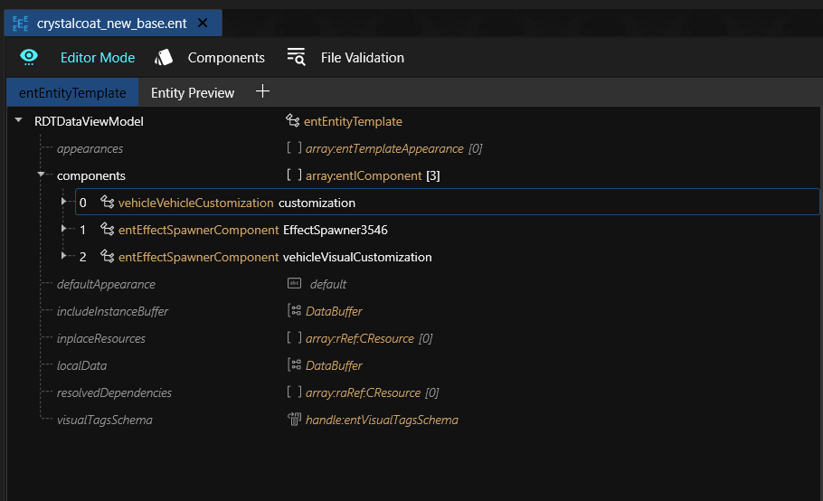

# Making Custom Microblends

**This guide was originally written by Halk and imported with their permission. You can find the original**[ **here**](https://docs.google.com/document/d/1oRjXHE08oDnaKwvgEOKxl0gZGkBADgSn2azCRwUeQLs/edit)**.**

The easiest/quicker way to make custom microblends is to have access to Photoshop and use ready-to-go seamless patterns. I like to look for these in [Pixabay](https://pixabay.com/images/search/seamless%20pattern/) and [Vecteezy](https://www.vecteezy.com/search?qterm=seamless-pattern-free\&content\_type=vector).

You can try making your own seamless pattern with the help of [this tutorial](https://www.youtube.com/watch?v=uB0IG2x2wPc) (for Photoshop).

1. After you download or make your pattern, make sure it’s a 1:1 seamless image. I recommend working on at least 1k (1024x1024) to keep the quality.

2. Turn everything you **don’t** want as microblend into transparency. You can magic wand if you’d like, but a quick way to do it is using the Color Range tool in PS. In my case, I’ll get rid of the grey areas.

.png>) .png>)

Upper menu: Select > Color Range > Use the eyedropper to select the color you want gone.

Change the Fuzziness to make it as clean as possible.

3. Lock the transparency on this layer, then fill or paint the pattern with **THIS PURPLE (#7f7fff)**.

.png>)

If set up like this, it will be a one color microblend. To make two or more colors, separate the elements you want and save multiple files to go into different layers of the mlsetup. For example:

.png>)

4. Save the file(s) as .png, and extract the **base\surfaces\microblends\scratches\_and\_flakes\_a.xbm** microblend from the files. Head over to Noesis and export your **custom microblend**(s) over the **scratches\_and\_flakes\_a**. You can also work with .dds by saving it in compression BC7.
5. Now simply custom-path your microblend(s) while making sure to path them into the **µblends** window on MlsetupBuilder OR in the microblend path in the .mlsetup on WolvenKit.

.png>)

.png>)

**IMPORTANT:** if you’re adding microblends into a custom port, don’t forget to make the microblend layer in the mlmask a neutral grey, otherwise it’ll screw with the microblend color. For me, the **50% grey (#959595)** from PS works perfectly.

.png>)
