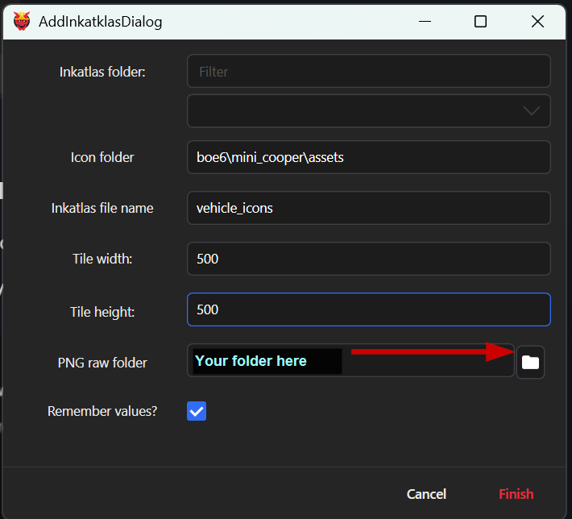

# 🖼️ Boe6's vehicles: GUI Images

## Summary

**Last documented update:** April 25 2025 by [manavortex](https://app.gitbook.com/u/NfZBoxGegfUqB33J9HXuCs6PVaC3 "mention")

This page will show you how to create custom GUI images for your vehicle.

## 1. The vendor icon


If you are using one of the existing in-game brands, you can skip this step and go straight to [#id-2.-the-call-menu](boe6s-vehicles-gui-images.md#id-2.-the-call-menu "mention")


### Step 1: Adding the files to your project

1. Find the file that is referenced in your record's `UIIcon.Brand_Logo`  and add it to your project (e.g. `base\gameplay\gui\common\icons\weapon_manufacturers.inkatlas` ).
2. Open the file, and find the .xbm referenced in `slots[0]` > `texture`&#x20;
3. Add this file to your project as well
4. Copy the texture path from `slot[1]`  to `slot[1]` (they should be using the same texture)
5. Save the inkatlas and close it
6. Now, [move](https://app.gitbook.com/s/-MP_ozZVx2gRZUPXkd4r/wolvenkit-app/editor/project-explorer#rename) the xbm (use Wolvenkit's rename dialogue, and check the box)
7. Repeat the process for the .inkatlas. The paths should update automatically, you should now have something like this:

<figure><figcaption></figcaption></figure>

8.  Now update the tweak: `UIIcon.Brand_Logo:` part of your yaml with the new atlasResourcePath.\
    Example:

    <pre><code>UIIcon.Brand_Logo:
    <strong>  atlasResourcePath: boe6\mini_cooper\assets\logos.inkatlas
    </strong></code></pre>

That's it - your car should now use your local files.

### Step 2: Editing your texture


For step-by-step procedures and the right settings, see [images-importing-editing-exporting.md](../../textures-and-luts/images-importing-editing-exporting.md "mention")


1. Export your .xbm to a .png file (see the info box)
2. Use your favourite graphics editor to exchange the "Mini" icon with your personal brand icon
3. Save the .png file with alpha channel (if you don't know how, refer to the link in the info box)
4. Use the import tool to import the texture again. "Transparency from alpha channel" should be automatically selected.

### Changing the texture slot name

This part is optional.

1. Open your .inkatlas file, and switch to the `Part Mapping` tab
2. Click on your logo and make sure that it's all inside the box:

<figure><figcaption><p>Notice the 'yaiba' text. This is what we will update next.</p></figcaption></figure>

3. In the UI on the right, change partName to refer to your brand. The slot name will update automatically. For example:

<figure><figcaption></figcaption></figure>

4. If your image does not fit the slot, you can switch back to the first tab and delete all other slots, then change the `clippingRectInUVCoords` property:

<figure><figcaption></figcaption></figure>

<figure><figcaption><p>Notice how the edges of the rectangle match the limits of the logo width/height</p></figcaption></figure>

#### Updating the file

Now update the tweak: `UIIcon.Brand_Logo:` part of your yaml with the new atlasPartName.\
Example:

<pre><code>UIIcon.Brand_Logo:
<strong>  atlasResourcePath: boe6\mini_cooper\assets\logos.inkatlas
</strong><strong>  atlasPartName: mini
</strong></code></pre>

Save and test.

Logo should now show as the updated image when scanned in-game. Example:

<figure><figcaption></figcaption></figure>

## 2. The call menu

Now we'll set your car's icon(s) for the call menu.&#x20;


You need at least Wolvenkit 8.16.2 for this (download [stable](https://github.com/WolvenKit/Wolvenkit/releases) | [Nightly](https://github.com/WolvenKit/WolvenKit-nightly-releases/releases))


### Step 1: Change the .yaml

Add the following lines to your .yaml (you need to repeat this process for every colour variant, unless you are using the `$instances` approach to tweak generation):

```yaml
...
  icon: 
    atlasPartName: boe6_mini_cooper_vcd
    atlasResourcePath: boe6\mini_cooper\assets\vehicle_icons.inkatlas
```

Now, it's time to take preview pictures.

### Step 2: Vehicle summon icons


Everyone hates preview pictures, and you need one for every colour of your car. If you don't know how to do this, look at [#taking-preview-pictures](../../custom-icons-and-ui/adding-items-preview-images/#taking-preview-pictures "mention") for a workflow.


1. Create a 500x500px icon for each of your car's colour variants.&#x20;


The .png files need to be named exactly like the `atlasPartName` property in the yaml.


2. In Wolvenkit, select File -> Add Files... -> Generate .inkatlas \
   
3. Fill the dialogue like this:\
   
4. Click the "Finish" button
5. Wolvenkit has generated two new .png files for you. Import them via the Import Tool.
6. Check your newly-generated inkatlas. You should see a preview, and everything should in general be fine.
7. If you start the game now, your car should have preview icons in the vehicle summon menu.

### Step 3: Virtual Car Dealer images

For the sake of simplicity, this guide will re-use the same icons for the Virtual Car Dealer preview.&#x20;

Simply add the following lines to your .yaml:

<pre class="language-yaml"><code class="lang-yaml"><strong>
</strong>Vehicle.boe6_mini_cooper.dealerPrice: 63000
Vehicle.boe6_mini_cooper.dealerCred: 8
Vehicle.boe6_mini_cooper.dealerAtlasPath: boe6\mini_cooper\assets\vehicle_icons.inkatlas
Vehicle.boe6_mini_cooper.dealerPartName: boe6_mini_cooper_vcd
</code></pre>

That's it — Virtual Car Dealer now knows what image goes with your car, and also what it should cost.

The images should display properly on both the vehicle call menu, and the virtual car dealer website.

<div><figure><figcaption></figcaption></figure> <figure><figcaption></figcaption></figure></div>

